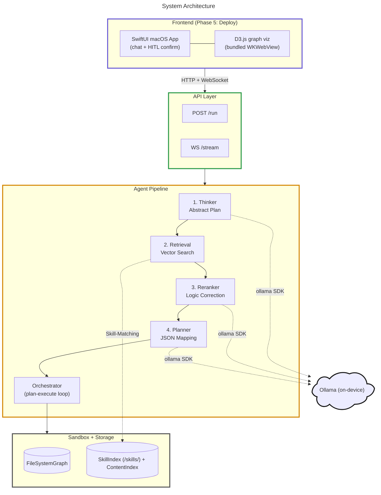

```mermaid
---
title: System Architecture
config:
  flowchart:
    curve: cardinal
---
flowchart TB
    accDescr: 5-Phase architecture. Frontend sends requests to the API layer which drives the agent pipeline (Thinker, Retrieval, Reranker, Planner, Orchestrator). The orchestrator mutates the sandbox storage and handles deployment updates. Thinker, Reranker and Planner call Ollama for on-device inference.

    subgraph Frontend["Frontend (Phase 5: Deploy)"]
        swift["SwiftUI macOS App<br/>(chat + HITL confirm)"]
        cyto["D3.js graph viz<br/>(bundled WKWebView)"]
        swift --- cyto
    end

    subgraph API["API Layer"]
        run["POST /run"]
        stream["WS /stream"]
    end

    subgraph Pipeline["Agent Pipeline"]
        thinker["1. Thinker<br/>Abstract Plan"]
        retrieval["2. Retrieval<br/>Vector Search"]
        reranker["3. Reranker<br/>Logic Correction"]
        planner["4. Planner<br/>JSON Mapping"]
        orchestrator["Orchestrator<br/>(plan-execute loop)"]
        
        thinker --> retrieval --> reranker --> planner --> orchestrator
    end

    subgraph Sandbox["Sandbox + Storage"]
        fsgraph@{ shape: cyl, label: "FileSystemGraph" }
        indexes@{ shape: cyl, label: "SkillIndex (/skills/) + ContentIndex" }
    end

    ollama@{ shape: cloud, label: "Ollama (on-device)" }

    Frontend -->|"HTTP + WebSocket"| API
    API --> Pipeline
    orchestrator --> Sandbox
    
    retrieval -.->|"Skill-Matching"| indexes
    
    thinker -.->|"ollama SDK"| ollama
    reranker -.->|"ollama SDK"| ollama
    planner -.->|"ollama SDK"| ollama

    classDef frontendLayer stroke:#6b5cd6,stroke-width:3px
    classDef apiLayer stroke:#2d9b4a,stroke-width:3px
    classDef pipelineLayer stroke:#d48806,stroke-width:3px
    classDef sandboxLayer stroke:#595959,stroke-width:3px
    classDef externalLayer stroke:#1a1a1a,stroke-width:3px

    class Frontend frontendLayer
    class API apiLayer
    class Pipeline pipelineLayer
    class Sandbox sandboxLayer
    class ollama externalLayer
```
